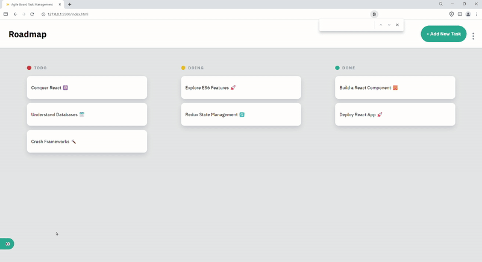

# Task Management System ReadMe

This readme file explains the functionalities and structure of the Task Management System codebase.

## Introduction

This project is a Task Management System implemented using HTML, CSS, and JavaScript. It allows users to manage tasks on different boards and provides features like adding, editing, and deleting tasks.

## Features

- **Board Management**: Users can create and switch between different boards to organize tasks.
- **Task Management**: Users can add, edit, and delete tasks on each board.
- **Filtering**: Tasks can be filtered by board.
- **Responsive Design**: The application is designed to work seamlessly across various screen sizes.

## Code Structure

The codebase is organized into different files and follows a modular structure for better maintainability.

### Files

1. **index.html**: 
2. **styles.css**:
3. **script.js**: 
4. **utils/taskFunctions.js**: 
5. **initialData.js**: 

### Functions

- **initializeData()**: This function checks if the local storage already contains data. If not, it loads initial data into the local storage.
- **fetchAndDisplayBoardsAndTasks()**: Fetches tasks from local storage and displays both boards and tasks accordingly.
- **displayBoards(boards)**: Displays boards in the DOM based on the provided array of board names.
- **filterAndDisplayTasksByBoard(boardName)**: Filters and displays tasks based on the selected board.
- **refreshTasksUI()**: Refreshes the user interface (UI) to reflect any changes in tasks.
- **styleActiveBoard(boardName)**: Styles the active board in the DOM.
- **addTaskToUI(task)**: Adds a task to the UI in the corresponding column.
- **setupEventListeners()**: Sets up event listeners for various UI elements.
- **toggleModal(show, modal)**: Toggles the display of a modal (like a pop-up window).
- **addTask(event)**: Handles the addition of a new task.
- **toggleSidebar(show)**: Toggles the display of the sidebar (like a hidden menu).
- **toggleTheme(show)**: Toggles the theme of the application (like switching between light and dark mode).
- **openEditTaskModal(task)**: Opens the edit task modal and fills it with task details.
- **saveTaskChanges(taskId)**: Saves any changes made to a task.
- **handleResize()**: Handles window resize events (like adjusting the layout when the window size changes).
## Conclusion

The Task Management System provides an intuitive interface for managing tasks efficiently. With its modular code structure and well-defined functionalities, it's easy to maintain and extend the application according to specific requirements.

### Project Overview

### Loom video

[My Loom](https://www.loom.com/share/87efc746dcd24e6ab2e6d9aed482a9e7?sid=888db6a2-5b54-4cb2-9de1-dea30f32e201)
